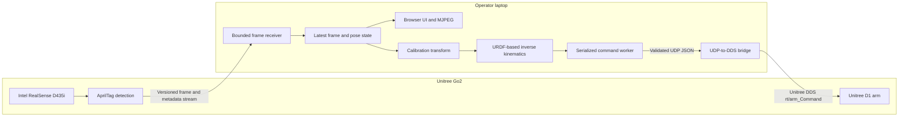

# Architecture

The project separates on-robot perception from laptop-side visualization, calibration, inverse kinematics, and command coordination.

## Data flow

1. The Go2 captures color frames and estimates the configured AprilTag pose in the camera frame.
2. A versioned, length-bounded TCP message carries JPEG data and structured metadata to the laptop.
3. The laptop retains only current perception state, applies the installation-specific camera-to-arm transform, and solves the D1 kinematic chain from the URDF.
4. Manual and follow-mode requests share one command path so robot commands remain ordered.
5. The laptop-side C++ bridge validates command payloads from its configured listener and publishes them to the D1 over Unitree DDS.

The browser is an operator surface, not a safety controller. Target freshness, IK convergence, configured bounds, physical supervision, and an isolated network remain required.
